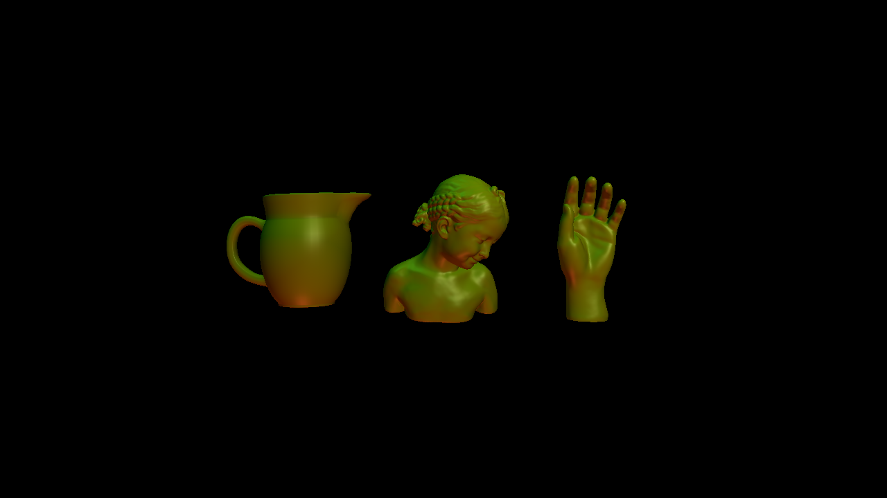

**Note: in order to get any points for this assignment, your submitted code should be compilable and able to run.**

In this assignment, using the sample code in the `glsl_examples/` directory and the provided skeleton code in `mesh_view_phong/`, you will write a simple OpenGL-based mesh viewer. The viewer should be able to accept a list of models as command line arguments and display them next to each other by correctly scaling and translating them. Each model should be shaded with the Blinn-Phong model (as described in the textbook), with the lighting computations done in the fragment shader. Running the `mesh_view_phong` executable with the following arguments should display the models in this configuration:

```
./src/olio_mesh_view -m ../data/models/jug/jug_lg.obj -m ../data/models/bimba/bimba.off -m ../data/models/hand/hand.off
```
**Note: because the path to the vertex and fragment shaders are hardcoded in the executable relative to the working directory (where the executable is run), the above command should be run inside the `build/` directory.**




The existing code in `mesh_view_phong/` comes with a Gouraud shader, where the lighting computation is done at the vertices by the vertex shader; the fragment shader simply interpolates the vertex colors. You will need to implement new vertex and fragment shaders for Phong shading, which will result in smoother colors and better specular highlights (see class notes for details). Note: the scene contains three point lights with different positions and colors. All the loaded meshes should have the same material as the sphere in the sample code.

In terms of user interaction, clicking and dragging the mouse should rotate the model(s) around the origin. Your application will need to track how much the x and y coordinates of the mouse cursor change as the mouse is being dragged in the window. The delta x will determine the amount of rotation around the y-axis (Ry), and delta y will determine the amount of rotation around the x-axis (Rx). The final model rotation will be the product of these two rotation matrices. You may need to install callbacks for mouse button and cursor position events. See the GLFW documentation about these callback functions, and how they can be installed:
https://www.glfw.org/docs/3.3/input_guide.html#input_mouse

Pressing the `x` key on the keyboard should bring the camera closer to the model(s) by reducing the current distance of the camera to the origin by 10%. Similarly, pressing the `z` key should move the camera farther away from the model(s) by increasing the current distance of the camera to the origin by 10%. Note that since the camera is positioned on the z-axis, only the z coordinate will change in both cases. Your code should prevent the z coordinate of the camera from becoming smaller than 0.01 units.

Pressing the spacebar should reset the rotation for the models and the camera position.

The displayed models should be scaled and translated as follows: each model should initially be (uniformly) scaled to fit in a unit cube. All the models should be arranged along the x-axis and scaled such that they all fit inside a 2x2x2 cube centered at the origin (as done in the solution executable). The camera should initially be placed at (0, 0, 2), looking at the origin along the -z direction, with an up-vector of (0, 1, 0), and a vertical field of view of 60 degrees.

It is highly recommended that you implement a new `TriMesh` class, similar to the `Sphere` class in the sample code, with these (and any other required) member functions:

```
bool Load(...);
void GetBoundingBox(...);
void DeleteGLBuffers(...);
void UpdateGLBuffers(...)'
void DrawGL(...);
```
